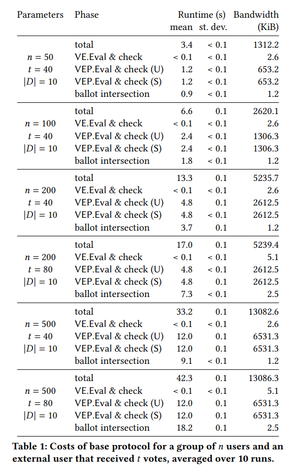

# Artefact Appendix (Required for all badges)

Paper title: **Practical Semi-Open Chat Groups for Secure Messaging Applications**

Requested Badge(s): **Reproduced**

## Description (Required for all badges)

- **Paper title**: Practical Semi-Open Chat Groups for Secure Messaging Applications
- **Authors**: Alex Davidson, Luiza Soezima and Fernando Virdia
- **Year**: 2026
- **URL** [ePrint 2025/469](https://eprint.iacr.org/2025/469)

This repository contains the source code for implementing our reputation protocol and the benchmarks reported in the paper, serving as a demonstration of the real-world viability of our system.

We provide implementations of the VE and VEP protocols from Figure 8, and of the functions described in Figure 9. Finally, we provide a full protocol run in `/src/protocol_run.cpp`.

The repository is organised as follows:

```shell
semi-open-messaging-groups/
   ├── benchmark_tables.py # Creates a table with benchmark results
   ├── benchmarks.sh # Script to run benchmark and forward results to JSON
   ├── build.sh # Script to build a Docker container to run experiments in
   ├── CMakeLists.txt # CMake build script
   ├── Dockefile # Dockerfile for the container
   ├── install_libsodium.sh # Script for installing libsodium (used by Dockerfile)
   ├── run.sh # Script to run the experiments
   ├── /src/ # Directory with source code
```

The  main implementation is located at `./src/`: 
```shell
/src/
   ├── main.cpp # Main execution for the benchmarks
   ├── utilities.cpp # Some utility functions
   ├── trivial_zkproof.cpp # Test file for ZK proof interface
   ├── dlog.cpp # Proof system for DLOG, cf. Figure 7
   ├── dlog_to_gen.cpp # Proof system for DLOG, using the Ristretto canonical generator as base
   ├── dleq.cpp # Proof system for DLEQ, cf. Figure 7
   ├── batched_dleq.cpp # Batched proof system for DLEQ, akin to cf. Figure 7
   ├── shuffle_compatible_dleq.cpp # Shuffle compatible Sigma protocol for DLEQ, App. A.5 of https://eprint.iacr.org/2021/588
   ├── fiat_shamir.cpp # Fiat Shamir proof system for a Sigma protocol
   ├── base_point.cpp # Ristretto canonical group generator
   ├── verifiable_exponentiation.cpp # VE(P) functionality, cf. Figure 8
   ├── shuffled_sigma_protocol.cpp # Shuffled Sigma protocol from a shuffled-compatible sigma protocol, cf. Fig 1 of 2021/588 (https://eprint.iacr.org/2021/588)
   ├── random_permutation.cpp # Implementation for random_permutation
   ├── repeated_sigma_protocol.cpp # Repeated Shuffled Sigma protocol
   ├── keccak.cpp # Public domain implementation of Keccak
   ├── protocol_run.cpp # Implementation of full protocol_run
   ├── parties.cpp # Implementation of User and Server functions, c.f. Figure 9
```

### Security/Privacy Issues and Ethical Concerns  (Required for all badges)

There are no Security/Privacy Issues and Ethical Concerns related to our code. Nonetheless, we stress that since this code provides a research prototype, using it in production is **discouraged**. 

## Basic Requirements (Required for Functional and Reproduced badges)

### Hardware Requirements  (Required for Functional and Reproduced badges)

We do not require any specific hardware to run our code. Our measurements were performed on an Intel(R) Core(TM) Ultra 5 235U CPU on a single core.

### Software Requirements (Required for Functional and Reproduced badges)

Our implementation is written in C++ and requires the following:
- `cmake 3.14` for building
- `clang-14` for compilation
- `python3` for building a Latex table from the benchmark output.

It also uses two external libraries:
- `libsodium` for  *Ristretto* and *SHA2* implementations - more information can be found at https://github.com/jedisct1/libsodium. This is automatically fetched when building the docker container.
- `XKCP` for the SHAKE implementation from the “compact” FIPS202 code - more information can be found at https://github.com/XKCP/XKCP/blob/master/Standalone/CompactFIPS202/C/Keccak-readable-and-compact.c. This is a public domain library and is shipped in our repository.

To execute the artefacts we support two settings, one for users with access to Debian 12.7 and another for users who may wish to run experiments on a Docker container based on Debian 12.7.

We do not require the use of any machine learning model or dataset.

### Estimated Time and Storage Consumption (Required for Functional and Reproduced badges)

The overall estimated time depends on the hardware specifications of the machine, as well as the type of environment used (Docker or Local). 

Considering that the environment is all set and configured, the execution of the benchmarks should take ~20 min (this includes the 10 repeated runs for all benchmarks) and it uses ~34M of disk storage.

## Environment (Required for all badges)

We now describe the environment needs and setup commands, as well as link the main repository for further access.

### Accessibility (Required for all badges)

The implementation is found at this GitHub Repository: https://github.com/luizabrs/semi-open-messaging-groups

### Set up the environment (Required for Functional and Reproduced badges)

### 1. Running with Debian(Linux)

To build the code in Debian 12, first install the following dependencies.
```bash
sudo apt install -y --no-install-recommends git build-essential cmake clang-14 python3
sudo bash install_libsodium.sh
```
Note, `install_libsodium.sh` will install libsodium system-wide, built from the `stable` branch of its repository.

### 1.1 Running benchmarks

The benchmarks can then be generated by running
```bash
cmake .
make
ulimit -s unlimited
./mr_impl 2>benchmarks.json
mkdir host
cp benchmarks.json host/benchmarks.json
```
The resulting data can be found in `benchmarks.json`.

To generate Table 1 in the paper, after you generated `benchmarks.json`, run the following command in the repository's root directory
```bash
python3 benchmark_table.py
```
This will print the Latex source for the table in the paper.

### 2. Running with Docker

For ease of reproducibility, we offer a Dockerfile generating the environment described above.

To build the environment, run
```bash
DOCKER=docker bash build.sh
```
To run the benchmark within the container, activate a session by running
```bash
DOCKER=docker bash run.sh
```
and in the resulting shell run the commands from [Running benchmarks](#11-running-benchmarks), which is the same as if you were running in Debian.

If using Podman, replace `DOCKER=docker` with `DOCKER=podman` when invoking the above commands.

### Expected run example

By the time you configure everything and run the benchmarks, you should see the output trace of 10 protocol runs.

An **example** output for one protocol run for a small example such as `benchmarks(5, 4);`, where `group_size = 5` and `votes = 4`, is as follows:

```
.
.
.
--- PROTOCOL RUN ---
U.Register...
User registered with public key: bc3a07cb80685f9b1ddc72315731b8fb3db96796ed18257f95023926886c9264
User registered with public key: 2da326a729aa6fd6cbad1742b6423429f4bcdcd302f58f409021fabb31a4391f
User registered with public key: 58eab397407bab7637892545a550bcd9ffdf96885c3b140c432cb48ec367aed5
User registered with public key: a9011e0902579beaf8e78966a12a9aa9beb128d56e9166e1de8759437841dca3
User registered with public key: e026a87112ebfb35a226f97b8fc9df9a0cb8696507e1f99104095ea0d87c8478
User registered with public key: d5357fcba2e2fabe95e531ca7cb31bab6fffe4ba57c3f24f6d653d63b920e65b
User registered with public key: d786b3516b06fbb25e09146a21b324d4707768d45cdf1e84205c6a15d1bd2406
User registered with public key: 87764685c699099d77f131647741ddb517ce54b75f86d4b303a0858b1df31d30
U.Vote...
Vote: 4  Ballot: 22571dea83fba811ba8d4ba8c795804154f576ed58d1000fd54599fb56b4bd55
Vote: 0  Ballot: 4e26f51fc0bce07aac6383ab9cface8df8fc4625e732b320fadfdb8b4e2f213e
Vote: 10  Ballot: 926591fe047db35d2672a2d533c2752dc445fdf48187c0bce716602dab685f04
Vote: 7  Ballot: c69835c7b8be8f4545c762ffc36293e78dafe83e3597c017149f823bdb481338
S.CreateGroup...
U.JoinGroup...
User 7ee64ab821a021e0e29b355885f7595581eec1f1032645b3a9e5069f1e3cbc70 joined group with token 1e423f816092c38a9293bc24386a2c114e2dd2aba1fbad19fcdce5a5246c6535
User a4f83fc5e560e9da226aed360543f90cf2676aeb5005f8faa734e9e86f96a137 joined group with token 80db085889278770826b638da01d0c3b55babc572ea152bad34065561bcef125
User ec382a0062df9e1047c24dcd0801eccfdbff93d1fe41a592222358e14e669667 joined group with token d009f1b939835d0d13236d8407d145511315cd12067f1d3dd0890541905c0c4c
User f0e77308c61edfe1cb9620ca6e49ac2ea80437f61b5a41693014a9646cfd6d49 joined group with token e8d7b9977ecfbd508710f26448d51a7a8a8f6c8d1b05da59bb4d32eead46eb29
User dca6f2acc210924213d88e3050b186d81c169aac9fea69f63987324f34cbf703 joined group with token ac452a57f26ee4aa1f4d4a98108e2e11cfcfdcaea7711439e967b2e3425afc47
External user initiates group-join request
Group size: 5
U.InitCount...
S.InitCount...
G.InitExp...
S.ShuffleExp...
U.ShuffleExp...
U/S.SendVotes...
Ballots present: 4
G.IntersectVotes...
     Sent votes: 4 0 10 7 
    Group votes: 10 7 
Recovered votes: 10 7 
(Exactly) the group votes were recovered successfully.
Admitting external into group
User 2acca9f7ec48b5e6481e1afbf5e49c2514471051776bbc968cabd7c360b55e28 joined group with token 3e17fa3b6eb253acaf51189547eeabc25ce144a93d6d44272b7ebbd0695e8268
--- PROTOCOL END ---
deleting token for 2acca9f7ec48b5e6481e1afbf5e49c2514471051776bbc968cabd7c360b55e28
deleting token for 7ee64ab821a021e0e29b355885f7595581eec1f1032645b3a9e5069f1e3cbc70
deleting token for a4f83fc5e560e9da226aed360543f90cf2676aeb5005f8faa734e9e86f96a137
deleting token for dca6f2acc210924213d88e3050b186d81c169aac9fea69f63987324f34cbf703
deleting token for ec382a0062df9e1047c24dcd0801eccfdbff93d1fe41a592222358e14e669667
deleting token for f0e77308c61edfe1cb9620ca6e49ac2ea80437f61b5a41693014a9646cfd6d49
deleting ballots for 2acca9f7ec48b5e6481e1afbf5e49c2514471051776bbc968cabd7c360b55e28
deleting ballots for 7ee64ab821a021e0e29b355885f7595581eec1f1032645b3a9e5069f1e3cbc70
deleting ballots for a4f83fc5e560e9da226aed360543f90cf2676aeb5005f8faa734e9e86f96a137
deleting ballots for a8116139874a0e61219a16664922ec96055ac7c69b813e5516ef498606beb87f
deleting ballots for c4e50526bb97071284cf90f6682a4ee1e7a27576810364b1c2e56bd0786eac68
deleting ballots for dca6f2acc210924213d88e3050b186d81c169aac9fea69f63987324f34cbf703
deleting ballots for ec382a0062df9e1047c24dcd0801eccfdbff93d1fe41a592222358e14e669667
deleting ballots for f0e77308c61edfe1cb9620ca6e49ac2ea80437f61b5a41693014a9646cfd6d49

.
.
.
```
 
## Artefact Evaluation (Required for Functional and Reproduced badges)

### Main Results and Claims

#### Main Result:

Our main result is an implementation that shows the practical viability of our protocol. 
We implemented:
- DLOG and DLEQ proof systems in Section 4.3,
- the verifiable exponentiation protocols in Section 5,
- the base protocol from Section 6 (including all algorithms from Figure 9). 

Our protocol scales up to 500 users, with a reasonable timing of 33s for `(users=500, votes=40)` and 42s for `(users=500, votes=80)`.

Our benchmarks confirm that most computing time is spent on the ballot intersection calculation, as it has a runtime of `O(users * votes * |vote domain|)`. In deployments, this could be amortised by trivially parallelising the loop.

### Experiments

To obtain the results in the paper we used a machine that runs an Intel(R) Core(TM) Ultra 5 235U CPU on a single core. 

Finally, running the commands in [Running benchmarks](#11-running-benchmarks), our code returns a Latex table containing the benchmarking numbers. These are the numbers reported in Sec. 7, Table 1 in the paper. 

<p align="center">
  
</p>

In the table, for each benchmark associated with the parameters `(n,t)`, where `n` is the number of users and `t` is the number of votes received by the external user wishing to join the group. We take the average runtime and communication cost for 10 runs.

## Limitations  (Required for Functional and Reproduced badges)

One of the limitations is that the current proof of concept implementation requires significant stack space for groups with more than 200 users. We enable this by using the command `ulimit -s unlimited` to release the stack memory limit. 

## Notes on Reusability (Encouraged for all badges)

This implementation is a research prototype, not production code. Yet, we aimed to design C++ interfaces that are general (through templating) and that closely follow the formal syntax of sigma protocols and zero-knowledge proof systems. This means that it should be possible to apply optimisations and replace components in our design without a significant labour overhead for the community.
